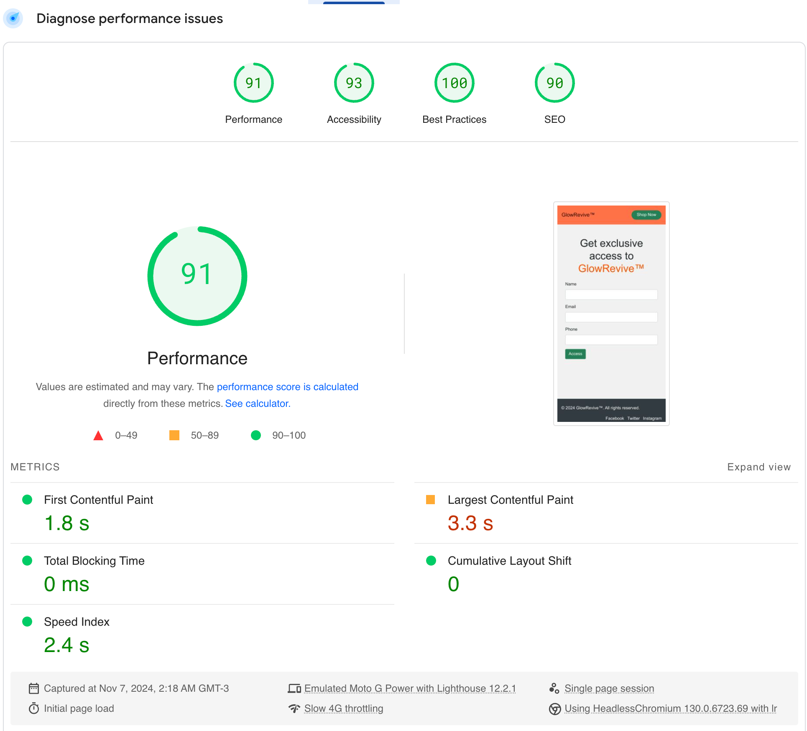
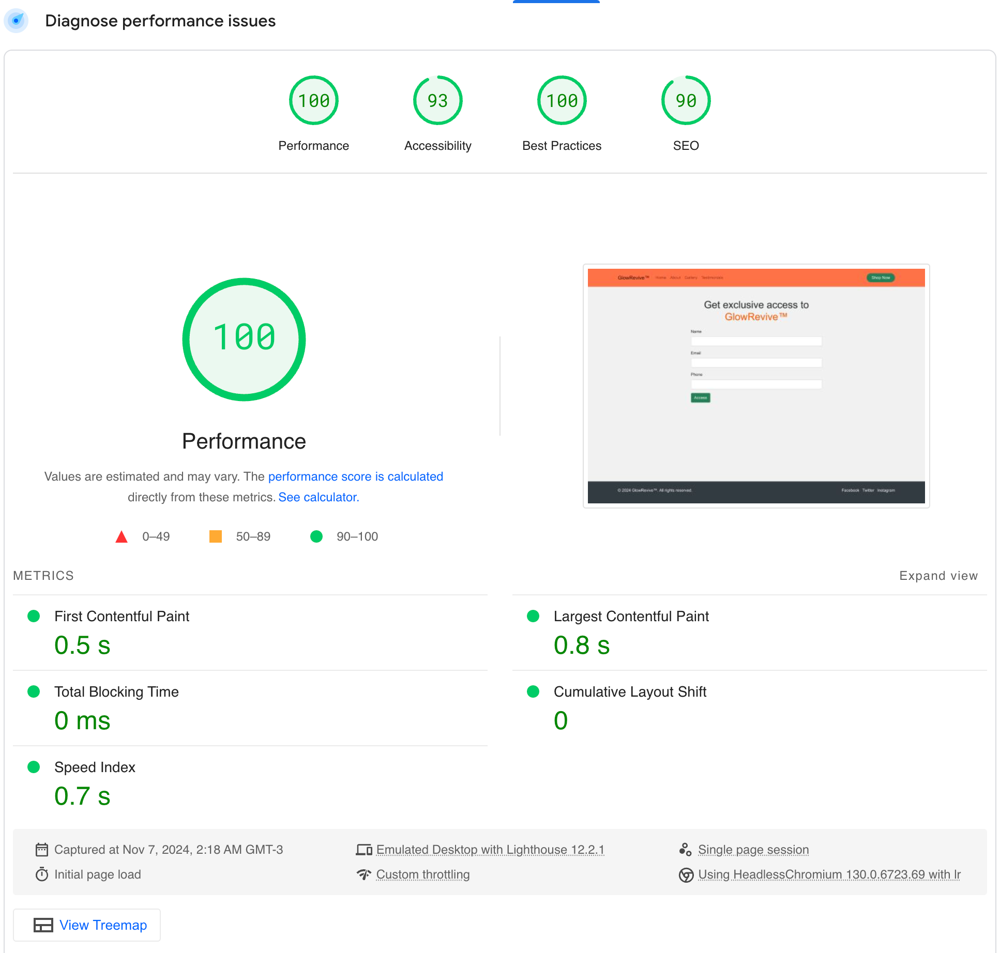

# GlowRevive - Landing Page Project

Este projeto consiste em uma landing page single page desenvolvida como parte de um teste técnico para desenvolvedor front-end. O projeto apresenta o produto GlowRevive, toda copy em inglês, sobre um revolucionário sérum facial, implementando um formulário de captura de leads e uma página de produto completa.

## 💫 Sobre o GlowRevive

GlowRevive é um sérum facial inovador que combina ingredientes naturais com tecnologia avançada para revitalização da pele. Todo o conteúdo textual do produto (copy) foi desenvolvido com auxílio de Inteligência Artificial (ChatGPT) para criar uma narrativa em inglês envolvente e persuasiva e imagens de banco de dados (Unsplash).

## 🚀 Tecnologias Utilizadas

- HTML5
- CSS3
- JavaScript (Vanilla)
- Bootstrap 4

## 📁 Estrutura do Projeto

```
├── assets/
│   ├── public/
│   │   └── images/
│   ├── css/
│   │   ├── style.css
│   │   └── form.css
│   ├── js/
│   │   ├── form.js
│   │   └── script.js
│   ├── assets/
│   │   ├── product1.jpg
│   │   ├── product[...].jpg
│   │   └── product10.jpg
├── index.html
└── README.md
```

### 🔤 Padrões de Código e Linguagem

O projeto foi desenvolvido seguindo estas convenções de linguagem:

- **Código**: Em inglês, para manter o padrão internacional e facilitar a manutenção
  ```javascript
  function validateEmail(email) {
      return emailRegex.test(email);
  }
  ```

- **Comentários**: Em português, para documentação clara da lógica de negócio
  ```javascript
    // Valida campo de nome (ao menos 3 caracteres)
  const nameRegex = /^[a-zA-ZÀ-ÖØ-öø-ÿ\s]{3,}$/;
  if (!nameRegex.test(name)) {
    showInvalidFeedback(nameInput, "name");
    return;
  }
  ```

### 📝 Separação de Arquivos JavaScript

O código JavaScript foi separado em dois arquivos principais para melhor organização e manutenção:

1. `form.js`: Gerenciamento do formulário de leads
   ```javascript
   // Aplica máscara ao campo de telefone
		phoneInput.addEventListener("input", () => {
			// Remove caracteres não numéricos
			let phone = phoneInput.value.replace(/\D/g, ""); 
			if (phone.length > 2) {
				phone = `(${phone.slice(0, 2)}) ${phone.slice(2, 7)}-${phone.slice(7, 11)}`;
			}
			phoneInput.value = phone;
		});
   ```

2. `product.js`: Funcionalidades da página de produto
   ```javascript
   // ######## Carousel
	// Adiciona o evento de clique para as thumbnails
	document.querySelectorAll(".thumbnail").forEach((thumbnail) => {
		thumbnail.addEventListener("click", function () {
			const index = this.getAttribute("data-index");
			$("#carouselHero").carousel(parseInt(index));
		});
	});
   ```

## 💡 Funcionalidades Implementadas

### Formulário de Captura
- Validação de e-mail usando regex
- Máscara de telefone no formato brasileiro (99) 99999-9999
- Mensagens de erro personalizadas
- Transição para a página de produto após preenchimento do formulário

### Página de Produto GlowRevive
- Header fixo
- Carrossel de imagens do produto com thumbnails
- Galeria com modal e navegação
- Slider de depoimentos
- Timer countdown para promoções exclusivas
- Footer com links para redes sociais

## 📱 Responsividade e Performance

### Resultados do PageSpeed Insights

#### Mobile

- Performance: 91/100
- Melhor que o requisito mínimo de 70 pontos
[Ir para resultado mobile](https://pagespeed.web.dev/analysis/https-blush-daveen-41-tiiny-site/eunmaro0n8?form_factor=mobile)

#### Desktop

- Performance: 100/100
- Superando o requisito mínimo de 90 pontos
[Ir para resultado desktop](https://pagespeed.web.dev/analysis/https-blush-daveen-41-tiiny-site/eunmaro0n8?form_factor=desktop)

## 🎯 Copy do Produto

O conteúdo textual do GlowRevive foi desenvolvido em inglês utilizando ChatGPT, focando em:
- Descrição envolvente do produto
- Benefícios principais
- Depoimentos convincentes
- Chamadas para ação (CTAs) persuasivas
- Textos promocionais para o countdown timer

Exemplo de copy gerada:
```text
"At GlowRevive™, we believe in celebrating authentic beauty by enhancing 
your skin's natural glow. Our products blend scientifically-backed botanicals
with luxurious natural ingredients to deliver a glowing complexion
and healthier, more resilient skin."
```

## 🔍 Como Testar

1. Clone o repositório
2. Abra o arquivo `index.html` em um navegador web
ou acesse diretamente o site: https://blush-daveen-41.tiiny.site/
3. Teste o formulário com diferentes inputs
4. Verifique a responsividade em diferentes dispositivos
5. Explore todas as funcionalidades da página de produto


## ⚠️ Requisitos do Sistema

- Navegadores modernos com suporte a ES6+
- Conexão com internet para carregamento do Bootstrap CDN

## 🎨 Design e Estilo

O design do projeto foi desenvolvido pensando na identidade visual do GlowRevive:
- Paleta de cores suaves e elegantes
- Tipografia clean e moderna
- Elementos visuais que transmitem luxo e qualidade
- Layouts responsivos que se adaptam a diferentes dispositivos

## 📫 Contato

Para mais informações sobre o projeto GlowRevive, entre em contato através do [lvieira268@email.com]

---
**Nota**: Este projeto é um teste técnico e o produto GlowRevive é fictício, criado apenas para demonstração de habilidades de desenvolvimento front-end.